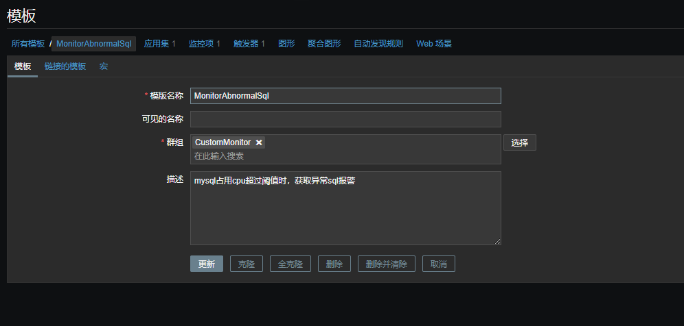
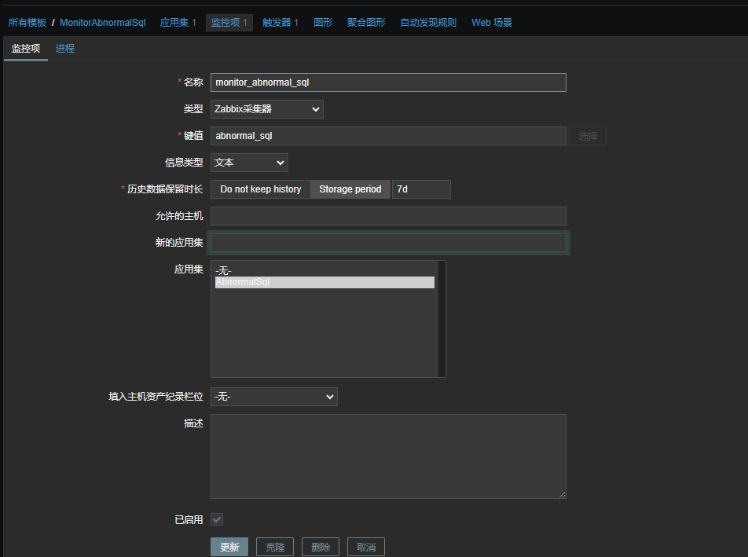
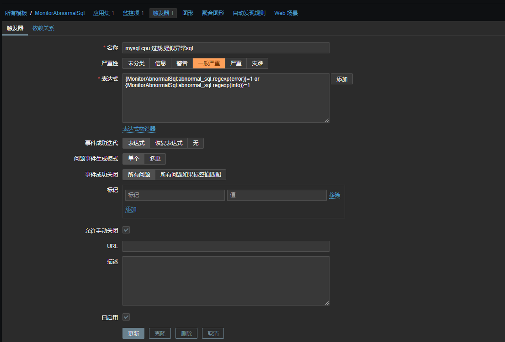

# A python script that can be combined with zabbix to monitor mysql statements with high CPU consumption

## Dependencies
1. linux
2. zabbix_sender
3. mysql client
4. python 3.6+

##  How it works
 First, the script will determine whether the cpu occupied by the mysql process exceeds the threshold set by cpu_threshold (the number of consecutive times exceeded by judge_times). After exceeding the limit, the script will use the top command to use the MySQL process pid to find out whether the MySQL thread ID that the cpu consumption exceeds the threshold set by mysql_cpu_threshold, and then find the specific SQL statements of these threads through the performance_schema.threads table of MySQL.

## How to deploy
  It is recommended to use supervisord to deploy the script.The configuration file can be referred to as follows:

    [program:tomcat]
    command=python3 /opt/MonitorAbnormalSql/main.py
    stdout_logfile=/opt/MonitorAbnormalSql/logs
    autostart=true
    autorestart=true
    priority=1

Create zabbix monitoring template:

